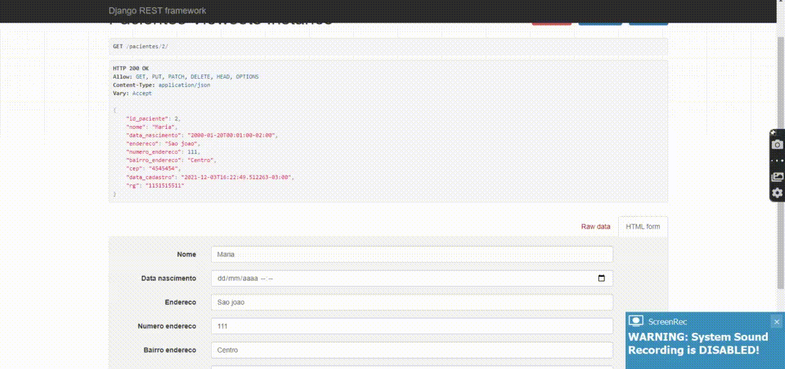

# API REstFull #

  
 

# Como rodar a aplicação
 - Criar um  **ambiente virtual**, pode ver como criar pesquisando no google dependendo do seu sistema operacional
 - Para rodar você deve usar o  **pip install -r requirements.txt** para instalar as bibliotecas
 - Após instalar as bibliotecas é só rodar a aplicação **python manage.py runserver**
 
 # O servidor vai rodar em : http://127.0.0.1:8000/

**O que tem na API**

- Usado para clinicas.

- Cadastro de pacientes.

- Agendamentos de pacientes.

- Históricos dos agendamentos vinculados com a tabela dos pacientes.

- Sitomas de cada pacientes agendado.

- Paciente nao pode ser agendado novamente para o mesmo horário de data.

**Qualquer duvidas Whatsapp = 74981199190**

# What's in the API #

- Used for clinics.

- Registration of patients.

- Patient appointments.

- History of appointments linked to the patient table.

- Symptoms of each scheduled patient.

- Patient cannot be re-scheduled for the same date time.

